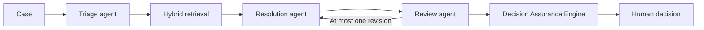

# AI Operations Copilot

**Evidence. Challenge. Human Decision.**

AI Operations Copilot is a human reviewed AI workspace demonstrated on support operations. It addresses a specific failure mode: a fluent model answer can still be unsupported, incomplete, or unsafe.

The model proposes. The system challenges. The human decides.

This is a portfolio engineering project by Adel Laghmari. It demonstrates practical project experience, not employment experience or a commercial production service.

## What makes it different

The application does not treat a model draft as a decision. Three AI stages produce and review a recommendation. Application owned deterministic logic then checks whether that recommendation is supportable.

The **Decision Assurance Engine** provides:

- **Assurance Gates** with explicit `PASS`, `WARNING`, `BLOCKED`, `HUMAN_REQUIRED`, and `ESCALATE` states
- an **Evidence Ledger** that maps claims to retrieved chunks
- **Potential Conflict Detection** for retrieved sources that may disagree
- **Safe Abstention** when the system should not recommend an action
- a printable **Decision Packet**
- deterministic **Decision Replay** between stored runs

These are inspectable evidence and process signals. They are not confidence percentages. The engine is application logic, not a fourth LLM agent.

## System flow



Hybrid retrieval combines PostgreSQL full text search and pgvector similarity search with Reciprocal Rank Fusion. The AI never sends a customer message. A person approves, edits, rejects, regenerates, or escalates.

## Stack

- React, TypeScript, Vite, Tailwind CSS, TanStack Query, project owned UI components
- FastAPI, Pydantic, SQLAlchemy 2 async, Alembic
- PostgreSQL 16, pgvector, full text search, Reciprocal Rank Fusion
- Microsoft Agent Framework
- Microsoft Foundry project Responses API through `FoundryChatClient`
- Azure OpenAI v1 embeddings with Microsoft Entra authentication
- Docker Compose, pytest, Vitest, Playwright, GitHub Actions
- Azure Container Apps and Vercel deployment definitions

## Runtime modes

| Mode | Behavior |
|---|---|
| `local` | Product and data features work locally. Model actions report Foundry unavailable unless configured. |
| `test` | Deterministic fixture provider used by tests and the seeded recruiter path. Output is labelled as a test fixture. |
| `foundry` | Real Foundry chat and Azure OpenAI embeddings. Only this mode may advertise Foundry execution. |

Production rejects `APP_MODE=test`. Anonymous public deployments disable demo reset, knowledge mutations, and evaluation execution. Public synthetic ticket growth is capped, each run accepts one human decision, and AI runs plus regenerations share a daily guest quota.

## Run locally

Copy `.env.example` to `.env`, then start the stack:

```bash
docker compose -f docker/docker-compose.yml up --build
```

Open:

- Frontend: http://localhost:5173
- API documentation: http://localhost:8000/docs
- Liveness: http://localhost:8000/api/health
- Readiness: http://localhost:8000/api/ready

The seeded test workspace contains synthetic customers, tickets, and knowledge only.

## Quality gate

```bash
cd backend
python -m ruff check .
python -m pytest
```

```bash
cd frontend
npm ci
npm run typecheck
npm run lint
npm test
npm run audit:copy
npm run build
npx playwright test
```

Default tests do not call paid cloud models. The browser suite uses seeded PostgreSQL and `APP_MODE=test`.

The Evaluation Lab runs deterministic fixture outputs against 44 synthetic golden cases. Classification, severity, escalation, and structured output checks are computed. Retrieval recall and citation coverage are not measured in that path because retrieval is empty. It is not an end to end retrieval benchmark.

## Public demo

The recruiter entry point is the frontend:

https://ai-operations-copilot-eight.vercel.app

Source: https://github.com/Adellaghmari/ai-operations-copilot

On 2026-10-09 the deployed frontend returned HTTP 200. API health reported `app_mode=foundry`, readiness reported `database=true`, and Foundry runs on that deployment showed the Evidence Ledger, Assurance Gates, and a recorded human decision. That record describes the deployed revision. It does not label later uncommitted work as live. The anonymous demo disables reset, knowledge mutations, and evaluation execution.

The API host, environment, and smoke checks are in [Deployment](docs/DEPLOYMENT.md).

## Engineering boundaries

- exactly three AI stages: Triage, Resolution, and Review
- maximum one Resolution revision after `REVISE`
- mandatory human decision ownership
- no fabricated Foundry output, evaluation scores, customer data, or confidence
- ticket text, uploads, and retrieved chunks are treated as untrusted content
- Foundry Hosted Agents and Foundry visual workflows are not the runtime
- typed helper functions exist, but they are not wired as model tool calls
- `EvaluationCase` and `AuditEvent` database models are currently reserved and are not active product features

## Repository

- `frontend/` React application and browser tests
- `backend/` API, workflow, retrieval, assurance, evaluation, and tests
- `evals/` versioned golden dataset
- `docs/` system design, retrieval, evaluation, responsible AI, Foundry setup, deployment, and recruiter guide
- `docker/` local PostgreSQL, API, and frontend stack
- `scripts/` maintenance helpers such as reindex
- `.github/` validation workflow

Start with [the recruiter guide](docs/RECRUITER_DEMO.md), then read [AI system design](docs/AI_SYSTEM_DESIGN.md) and [architecture](docs/ARCHITECTURE.md).
