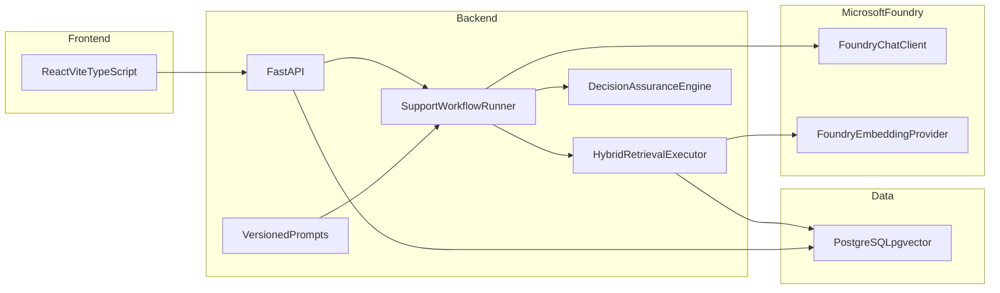

# Architecture

AI Operations Copilot is a monorepo decision-assurance product demonstrated on support operations. The intellectual center is AI system design: structured multi-agent workflow, hybrid retrieval, grounded generation, inspectable assurance gates, human review, and evaluation.

## System diagram

## Why this shape

The business flow has a natural order. Sequential orchestration is easier to explain, test, and persist than autonomous multi-agent loops.

The application owns agent definitions, prompts, orchestration, retrieval, assurance, and human-review state. Microsoft Foundry provides model inference through its project Responses API. Embeddings use Azure OpenAI v1 with Microsoft Entra authentication. Foundry evaluation helpers exist but are not used by the current product path.

Foundry Hosted Agents are not used. The Python hosting package is prerelease, and extra container compute is out of scope for this project.

## Frontend

- React + TypeScript (strict) + Vite
- Tailwind CSS with project owned accessible UI components
- React Router
- TanStack Query for server state
- English SaaS UI with honest loading, empty, and error states

## Backend

- FastAPI, Pydantic v2
- SQLAlchemy 2 async + Alembic
- Layered modules: API, schemas, services, repositories, models
- Dedicated `ai` package for agents, workflow, retrieval, prompts, providers, tools, evaluation, and observability

## Data

PostgreSQL stores operational records and knowledge chunks. The public demo uses Azure Database for PostgreSQL Flexible Server 16 in Sweden Central. `pgvector` (`vector` 0.8.2) stores embeddings as `vector(1536)`. Full-text search uses `tsvector` plus a GIN index. Embedding model name and dimensions are stored so incompatible indexes are not mixed.

## Observability

Production traces export to the existing Application Insights resource `adel-ai-operations-foundry-appinsights` through `AzureMonitorTraceExporter`. Connection string is a Container Apps secret (`APPLICATIONINSIGHTS_CONNECTION_STRING`). `ENABLE_SENSITIVE_TELEMETRY=false`. Spans cover the FastAPI request, `ai.workflow`, Triage, hybrid retrieval (embedding, vector, lexical, RRF), Resolution, Review, optional revision, `ai.assurance` (gates, evidence ledger, conflict detection, abstention), `ai.decision_packet`, `ai.decision_replay`, and the human-review transition. Ticket bodies, prompts, chunk text, and secrets are not exported.

## AI runtime

`APP_MODE` selects the provider:

- `local` — no fabricated model output
- `test` — deterministic fixtures labeled as fixtures
- `foundry` — `FoundryChatClient` + Entra Azure OpenAI v1 embeddings

Chat uses the Foundry project Responses API via `FoundryChatClient` and `DefaultAzureCredential`. Embeddings use the separate Azure OpenAI v1 endpoint (`FOUNDRY_MODELS_ENDPOINT`), not the project endpoint. The installed `FoundryEmbeddingClient` is not used because it requires an API key.

## Deployment target

Lowest-friction live path after credentials exist:

- Frontend on Vercel
- Backend on Azure Container Apps
- Azure Database for PostgreSQL Flexible Server with pgvector
- Microsoft Foundry for models

No Terraform and no elaborate CI/CD in this project.

## Related documents

- [AI_SYSTEM_DESIGN.md](AI_SYSTEM_DESIGN.md)
- [RAG.md](RAG.md)
- [EVALUATION.md](EVALUATION.md)
- [RESPONSIBLE_AI.md](RESPONSIBLE_AI.md)
- [PROMPT_ENGINEERING.md](PROMPT_ENGINEERING.md)
- [FOUNDRY_SETUP.md](FOUNDRY_SETUP.md)
- [DEPLOYMENT.md](DEPLOYMENT.md)
- [RECRUITER_DEMO.md](RECRUITER_DEMO.md)
