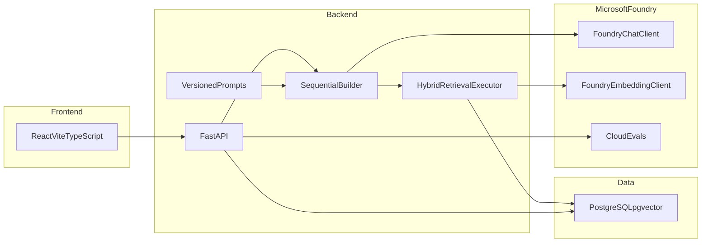

# Architecture

AI Operations Copilot is a monorepo support-operations product. The intellectual center is AI system design: structured multi-agent workflow, hybrid retrieval, grounded generation, human review, and evaluation.

## System diagram

## Why this shape

The business flow has a natural order. Sequential orchestration is easier to explain, test, and persist than autonomous multi-agent loops.

The application owns agent definitions, tools, prompts, and human-review state. Microsoft Foundry provides model inference, embeddings, optional cloud evaluation, and tracing sinks.

Foundry Hosted Agents are not used. The Python hosting package is prerelease, and extra container compute is out of scope for this project.

## Frontend

- React + TypeScript (strict) + Vite
- Tailwind CSS + shadcn/ui
- React Router
- TanStack Query for server state
- English SaaS UI with honest loading, empty, and error states

## Backend

- FastAPI, Pydantic v2
- SQLAlchemy 2 async + Alembic
- Layered modules: API, schemas, services, repositories, models
- Dedicated `ai` package for agents, workflow, retrieval, prompts, providers, tools, evaluation, and observability

## Data

PostgreSQL stores operational records and knowledge chunks. `pgvector` stores embeddings. Full-text search uses `tsvector`. Embedding model name and dimensions are stored so incompatible indexes are not mixed.

## AI runtime

`APP_MODE` selects the provider:

- `local` — no fabricated model output
- `test` — deterministic fixtures labeled as fixtures
- `foundry` — `FoundryChatClient` + `FoundryEmbeddingClient`

Chat uses the Foundry project Responses API. Embeddings use the separate models endpoint. Official Microsoft documentation states that the project endpoint does not currently route embeddings.

## Deployment target

Lowest-friction live path after credentials exist:

- Frontend on Vercel
- Backend on Azure Container Apps
- Azure Database for PostgreSQL Flexible Server with pgvector
- Microsoft Foundry for models

No Terraform and no elaborate CI/CD in this project.

## Related documents

- [AI_SYSTEM_DESIGN.md](AI_SYSTEM_DESIGN.md)
- [RAG.md](RAG.md)
- [EVALUATION.md](EVALUATION.md)
- [RESPONSIBLE_AI.md](RESPONSIBLE_AI.md)
- [PROMPT_ENGINEERING.md](PROMPT_ENGINEERING.md)
- [DEPLOYMENT.md](DEPLOYMENT.md)
- [INTERVIEW_ARCHITECTURE_NOTES.md](INTERVIEW_ARCHITECTURE_NOTES.md)
